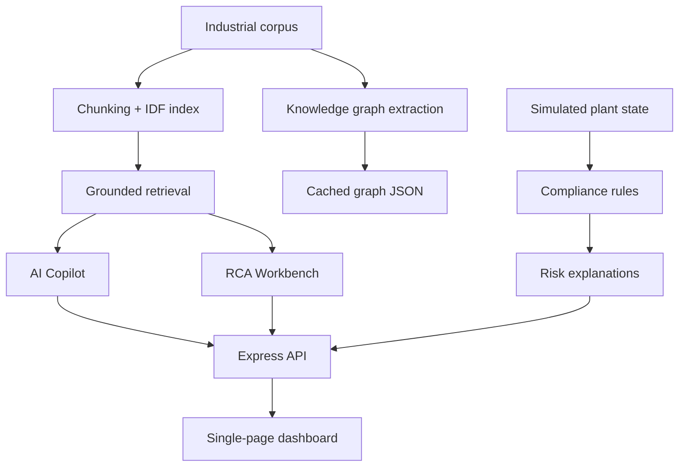

# BRAIN AI

<div align="center">

### Unified Asset & Operations Brain

*An AI-powered industrial knowledge intelligence platform for grounded RAG, knowledge graph exploration, root cause analysis, and compliance checks.*

[](https://nodejs.org)
[](https://expressjs.com)
[](https://ai.google.dev)
[](LICENSE)

**Built for ET Hackathon 2026**

[Demo](presentation_deck.html) · [Quick Start](#-quick-start) · [Features](#-what-this-project-does) · [API](#-api-reference)

</div>

---

## The Product

BRAIN AI is a single-page industrial operations dashboard that turns maintenance manuals, work orders, inspection records, and incident notes into a grounded assistant for plant teams.

The UI is organized into five working areas:

- **Overview** for high-level status and live metrics.
- **AI Copilot** for grounded Q&A over the ingested corpus.
- **Knowledge Graph** for entity and relationship exploration.
- **RCA Workbench** for 5-Whys and fishbone-style diagnostics.
- **Compliance** for rule-based safety checks and violation explanations.

---

## What This Project Does

This repository demonstrates a practical operations workflow built around a small industrial corpus:

1. It loads and chunks the document set at startup.
2. It builds an IDF-backed retrieval index for grounded answers.
3. It exposes a copilot endpoint that refuses to answer when the corpus does not support the claim.
4. It generates RCA output with safe fallbacks for known failure scenarios.
5. It evaluates a simulated compliance state against OISD-style rules and returns explanations for violations.
6. It serves a cached knowledge graph that can be rebuilt from the corpus.

The result is a demo-friendly operations brain that stays tied to the actual documents instead of drifting into generic chatbot behavior.

---

## System Flow



---

## Features

- Grounded RAG copilot backed by corpus retrieval and refusal gating.
- Knowledge graph view with cached entity and relationship data.
- RCA generator with 5-Whys and fishbone outputs for known assets and incidents.
- Compliance dashboard with deterministic rule checks and fallback explanations.
- Browser-served UI with tab navigation and live status checks.
- LLM connectivity test route for quickly verifying provider access.

---

## Tech Stack

| Layer | Technology |
|---|---|
| Frontend | HTML, CSS, Vanilla JavaScript |
| Backend | Node.js, Express |
| Retrieval | Corpus chunking + IDF scoring |
| LLM Routing | Gemini-first with Groq fallback |
| Data | Local text corpus + cached graph JSON |
| Delivery | Express static hosting |

---

## Repository Layout

| Path | Purpose |
|---|---|
| [public/index.html](public/index.html) | Main dashboard shell |
| [public/js/app.js](public/js/app.js) | Tab switching, status checks, and dashboard wiring |
| [public/js/copilot.js](public/js/copilot.js) | Copilot UI logic |
| [public/js/graph.js](public/js/graph.js) | Knowledge graph rendering |
| [public/js/rca.js](public/js/rca.js) | RCA UI logic |
| [public/js/compliance.js](public/js/compliance.js) | Compliance UI logic |
| [server/server.js](server/server.js) | Express app bootstrap and route mounting |
| [server/routes/copilot.js](server/routes/copilot.js) | Grounded Q&A endpoint |
| [server/routes/rca.js](server/routes/rca.js) | Root cause analysis endpoint |
| [server/routes/compliance.js](server/routes/compliance.js) | Compliance checks endpoint |
| [server/routes/ingest.js](server/routes/ingest.js) | Corpus rebuild endpoint |
| [server/data/corpus](server/data/corpus) | Ingested source documents |
| [server/data/knowledge_graph.json](server/data/knowledge_graph.json) | Cached graph output |

---

## Quick Start

```bash
# Install dependencies
npm install

# Start the app
npm start

# Development mode with file watching
npm run dev
```

Open the dashboard at the local server URL printed in the terminal.

---

## Environment

Create a `.env` file if you want live LLM-backed responses:

```bash
GEMINI_API_KEY=your_key_here
GROQ_API_KEY=your_key_here
PORT=3000
```

If no keys are configured, the app uses safe fallback behavior and cached demo content where available.

---

## API Reference

### `POST /api/test-llm`

Checks whether the LLM layer is reachable.

Request:

```json
{
  "prompt": "ping",
  "jsonMode": false
}
```

### `POST /api/copilot`

Grounded question-answering over the ingested corpus.

Request:

```json
{
  "query": "What does the PMP-302 manual say about lubrication checks?"
}
```

### `POST /api/rca`

Generates 5-Whys and fishbone categories from an incident description.

Request:

```json
{
  "incidentDescription": "Pump PMP-302 seized during startup",
  "assetId": "PMP-302"
}
```

### `GET /api/compliance`

Returns the current compliance matrix and any violation explanations.

### `POST /api/compliance/resolve`

Updates the simulated plant state for a specific rule and recomputes the matrix.

### `POST /api/ingest/rebuild`

Refreshes the cached knowledge graph and document ingestion pipeline.

---

## Data Sources

The current demo corpus includes:

- [server/data/corpus/pmp302_manual.txt](server/data/corpus/pmp302_manual.txt)
- [server/data/corpus/pmp302_workorders.txt](server/data/corpus/pmp302_workorders.txt)
- [server/data/corpus/b401_sop.txt](server/data/corpus/b401_sop.txt)
- [server/data/corpus/b401_workorders.txt](server/data/corpus/b401_workorders.txt)
- [server/data/corpus/c102_inspection.txt](server/data/corpus/c102_inspection.txt)
- [server/data/corpus/oisd_std_189.txt](server/data/corpus/oisd_std_189.txt)
- [server/data/corpus/near_miss_incidents.txt](server/data/corpus/near_miss_incidents.txt)

These documents feed the retrieval layer, RCA fallback data, compliance context, and knowledge graph cache.

---

## Notes

- The UI is intentionally demo-oriented and runs as a browser app served by Express.
- The copilot is designed to refuse unsupported answers instead of guessing.
- The RCA and compliance modules include safe fallbacks so the experience still works without live model access.

---

## License

MIT License.
