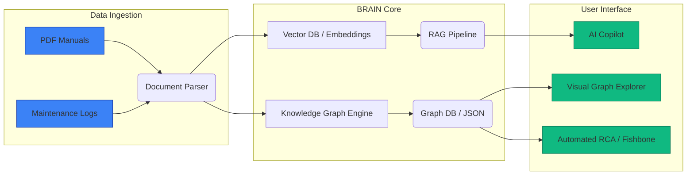

# BRAIN AI
**Industrial Knowledge Intelligence Platform**
Bridging the gap between raw industrial data and actionable operational intelligence.

---

## The Problem in Industrial Operations

- **Knowledge Silos**: Maintenance logs, manuals, and sensor data are scattered.
- **Downtime Costs**: When a machine fails, technicians spend hours digging through 500-page manuals to find the root cause.
- **Brain Drain**: Experienced engineers retire, taking decades of intuitive troubleshooting knowledge with them.
- **Reactive vs Proactive**: Most facilities react to failures rather than predicting them based on historical context.

---

## Our Solution: BRAIN AI

An intelligent, context-aware platform that ingests unstructured industrial data and transforms it into an interconnected **Knowledge Graph**. 

It empowers frontline workers with:
1. **Interactive Knowledge Graphs** to visualize relationships between components and faults.
2. **Automated Root Cause Analysis (RCA)** using Fishbone (Ishikawa) diagrams.
3. **AI Copilot (RAG)** for instant, context-grounded answers.

---

## System Architecture

---

## Core Features & Prototype

### 1. The Interactive Knowledge Graph
Maps out components, their common faults, and dependencies.
*(Insert Screenshot Here: Knowledge Graph Node UI)*

### 2. Automated Root Cause Analysis (RCA)
Generates dynamic Fishbone diagrams categorized by Machine, Method, Material, etc. based on the specific fault.
*(Insert Screenshot Here: Fishbone Diagram UI)*

### 3. AI Copilot with Context Grounding
Chat interface that answers troubleshooting queries by strictly referencing ingested manuals. Highlights the exact source chunks.
*(Insert Screenshot Here: AI Copilot Chat Interface)*

---

## The Tech Stack

- **Frontend**: Vanilla JS, HTML5, CSS3 (Custom Glassmorphism UI), D3.js (Graph Visualization)
- **Backend**: Node.js, Express
- **AI/ML**: Large Language Models for semantic extraction, embeddings for vector search.
- **Data Structuring**: Custom Graph JSON architecture for lightweight, high-speed rendering.

*We kept the stack lean to ensure high performance and easy deployability on edge servers in industrial plants.*

---

## Business Impact & Value

- **Reduced MTTR (Mean Time To Repair)**: Cuts troubleshooting time by up to 70%.
- **Preserved Institutional Knowledge**: Captures insights from veteran technicians into a centralized brain.
- **Cost Efficiency**: Reduces unplanned downtime, which can cost thousands of dollars per minute in manufacturing.
- **Scalability**: Can be expanded to any industry—aviation, automotive, energy, or maritime.

---

# Thank You
**Ready to revolutionize industrial maintenance.**
