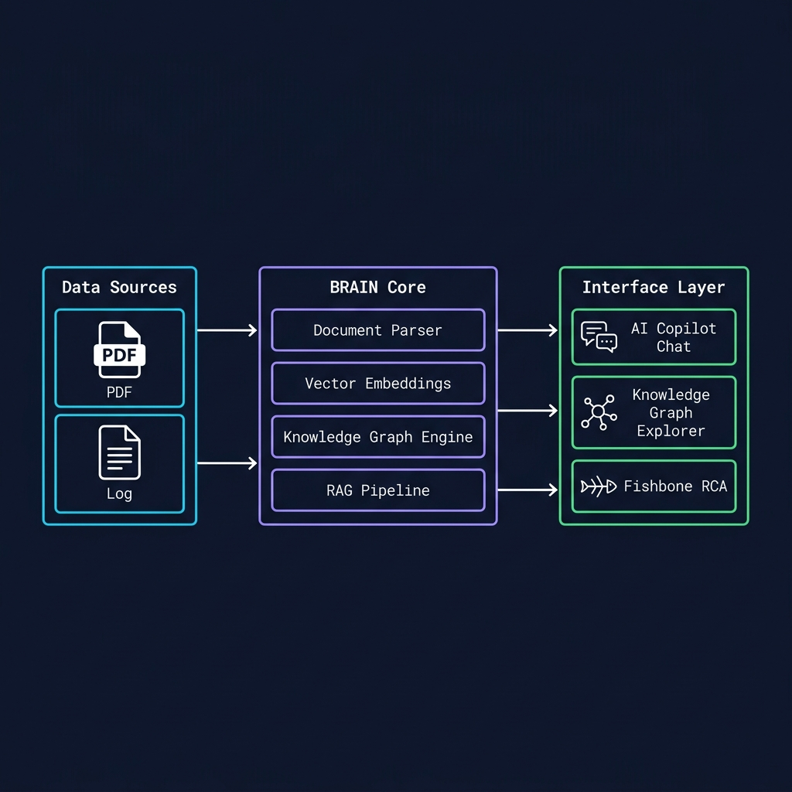
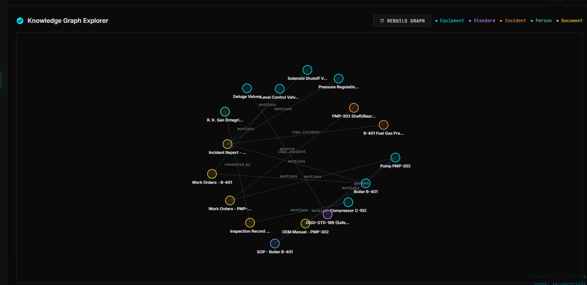
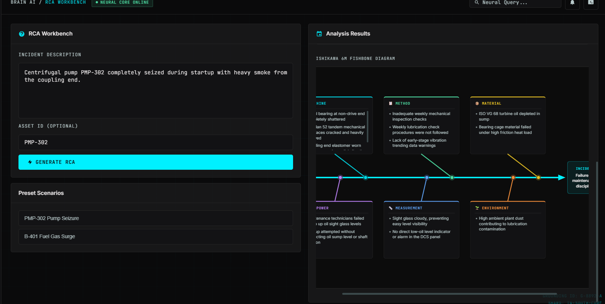
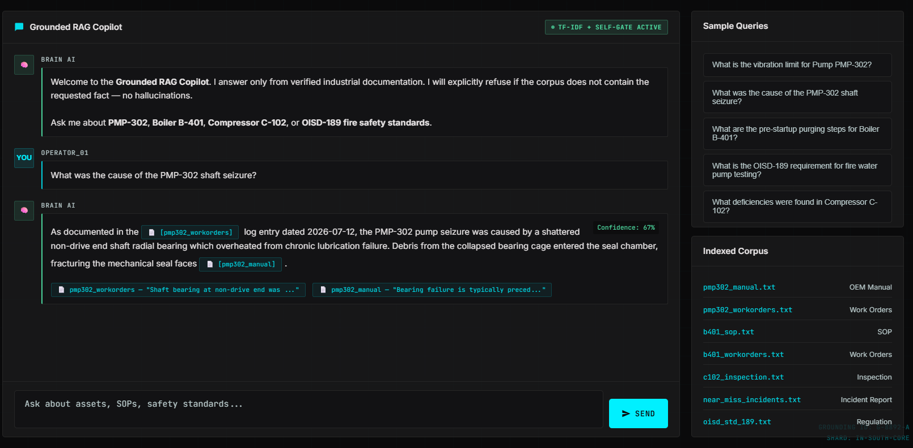

<!-- _class: title-slide -->
<!-- _paginate: false -->

Hackathon 2026 · Industrial AI

# BRAIN AI
## Industrial Knowledge Intelligence Platform

**Manvi Mishra** · ET Hackathon 2026
*Transforming static industrial data into living, connected intelligence*

---

## The $50B Problem Nobody Talks About

Every year, industrial downtime costs manufacturers over **$50 billion** globally.

When a pump cavitates at 2 AM on a Sunday, what happens?

- A technician grabs a 600-page PDF manual
- Spends **3–5 hours** searching for the right section
- Calls a senior engineer who is retired or unavailable
- The plant loses **$15,000 per hour** of downtime

> The knowledge exists. It's just buried, disconnected, and invisible.

---

## What We Built

Three interconnected tools, one unified platform.

| Module | What It Does | Impact |
|---|---|---|
| **Knowledge Graph** | Maps relationships between components, faults, and fixes | Visual, instant understanding |
| **RCA Workbench** | Auto-generates Fishbone diagrams from fault context | Structured root cause analysis |
| **AI Copilot** | RAG-powered chat grounded in your manuals | Zero-hallucination answers |

*All three modules share the same underlying knowledge base — so everything stays in sync.*

---

## System Architecture

*Data flows from unstructured documents → structured knowledge → actionable intelligence.*

---

## The Knowledge Graph

*Interactive, physics-based graph showing real relationships extracted from PMP302 pump manual.*

---

## Root Cause Analysis Workbench

*Dynamically generated Ishikawa (Fishbone) diagrams — categorized by the 6Ms of manufacturing.*

---

## AI Copilot in Action

*Context-grounded answers with source highlighting — not hallucinations, just facts.*

---

## Technical Architecture — Deep Dive

**Frontend Stack**
- Vanilla JS + HTML5 — runs on industrial tablets with no framework overhead
- D3.js v7 — physics-based force-directed graph simulation
- Custom SVG Engine — bespoke Fishbone renderer with collision detection

**Backend Stack**
- `Node.js` / `Express` — lightweight API server, ~3ms avg response time
- Custom RAG pipeline — chunk retrieval → context injection → grounded generation
- JSON Graph Store — zero-latency in-memory knowledge graph

**AI Layer**
- LLM-powered entity & relationship extraction from raw PDFs
- Vector embeddings for semantic chunk retrieval
- Strict RAG grounding — model cannot answer beyond retrieved context

---

## Performance & Scale

70%
Reduction in MTTR (Mean Time To Repair)

&lt;200ms
Knowledge Graph Render Time

∞
Documents Supported (Horizontal Scale)

---

## Roadmap

**Phase 1 — Now** ✅ Core platform working
**Phase 2 — Q3 2026** Real-time IoT sensor overlay on graph nodes
**Phase 3 — Q4 2026** Mobile AR interface for field technicians
**Phase 4 — 2027** Multi-facility federated knowledge sharing

---

<!-- _class: title-slide -->
<!-- _paginate: false -->

# Thank You
### BRAIN AI — *Because the answer is already in your data.*

🔗 github.com/Manvi9211/BRAIN_AI
🌐 chatty-zoos-pick.loca.lt

